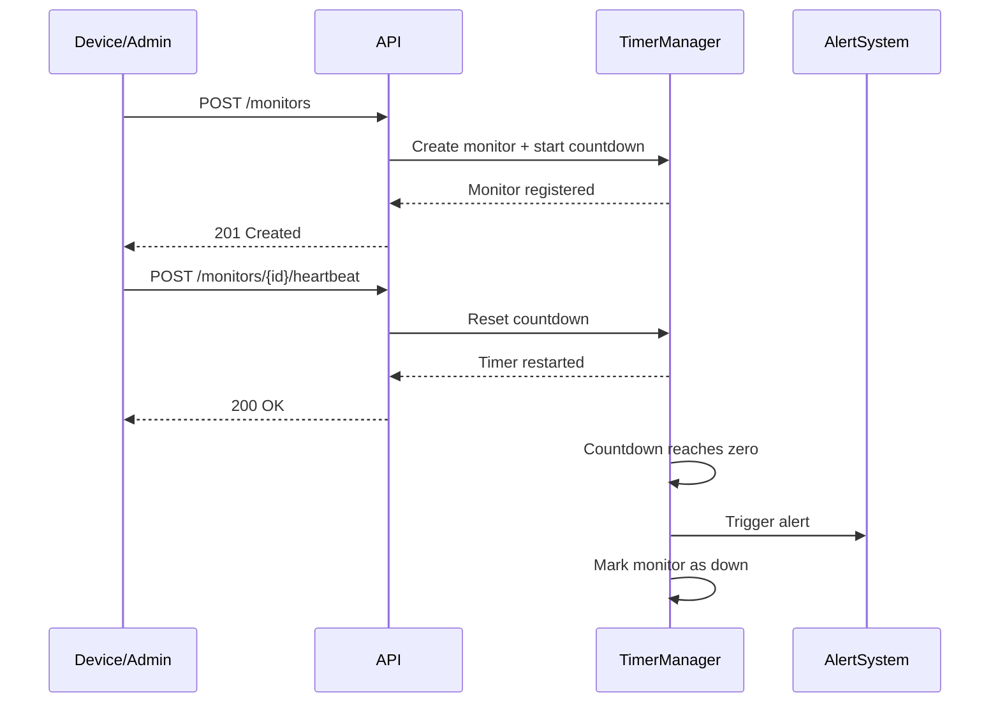

# Pulse-Check API — Dead Man’s Switch Monitoring System

A backend service that monitors remote devices by expecting periodic heartbeats.
If a device fails to send a signal within a defined timeout, the system automatically triggers an alert.

---

## 1. Architecture Diagram



**Explanation:**
Each device registers a monitor with a timeout. The system starts a countdown timer.
Every heartbeat resets the timer. If no heartbeat is received before timeout, the system triggers an alert and marks the device as **down**.

---

## 2. Setup Instructions

### Clone Repository

```bash
git clone https://github.com/YOUR_USERNAME/pulse-check-api.git
cd pulse-check-api
```

### Create Virtual Environment

```bash
python -m venv .venv
source .venv/bin/activate   # Linux / Mac
# .venv\Scripts\activate    # Windows
```

### Install Dependencies

```bash
pip install fastapi uvicorn pydantic
```

### Run Server

```bash
uvicorn main:app --reload
```

### Access API Docs

```
http://127.0.0.1:8000/docs
```

---

## 3. API Documentation

### 🔹 Create Monitor

**POST /monitors**

Registers a new device monitor and starts a countdown.

**Request:**

```json
{
  "id": "device-123",
  "timeout": 60,
  "alert_email": "admin@critmon.com"
}
```

**Response:**

```json
{
  "message": "Monitor device-123 created successfully",
  "status": "active",
  "remaining_seconds": 60
}
```

---

### 🔹 Send Heartbeat

**POST /monitors/{id}/heartbeat**

Resets the timer for a device.

**Responses:**

* `200 OK` → Timer reset
* `404 Not Found` → Device not registered

---

### 🔹 Pause Monitor (Bonus Feature)

**POST /monitors/{id}/pause**

Pauses monitoring (no alerts triggered).

---

### 🔹 Get Monitor Status

**GET /monitors/{id}/status**

Returns real-time monitor state.

**Response:**

```json
{
  "id": "device-123",
  "status": "active",
  "timeout": 60,
  "remaining_seconds": 42,
  "last_heartbeat": "2026-04-25T10:30:00"
}
```

---

### 🔹 Get All Monitors

**GET /monitors**

Returns all registered monitors.

---

## 4. Design Decisions

### 1. In-Memory Storage

* Used Python dictionaries for simplicity and speed
* Suitable for prototype/demo environments
* Trade-off: Data is lost on restart

---

### 2. Async Timer Management (asyncio)

* Each monitor runs a non-blocking countdown task
* Efficient for handling multiple devices concurrently
* Avoids thread overhead

---

### 3. Deadline-Based Timing

* Instead of just counting seconds, a deadline timestamp is stored
* Enables accurate calculation of `remaining_seconds`
* Improves observability for users

---

### 4. Separation of Concerns

* Timer logic (`countdown`, `start_timer`) separated from API routes
* Keeps code modular and easier to maintain

---

### 5. Simulated Alert System

* Alerts are logged using `console.log` (print)
* In production, this would be replaced with:

  * Email services (SMTP, SendGrid)
  * Webhooks
  * SMS/Push notifications

---

## Limitations

* No persistent database
* No authentication/security
* Not horizontally scalable
* Alerts are simulated only

---

## Future Improvements

* Integrate PostgreSQL for persistent storage
* Use Redis + Celery for reliable background jobs
* Add authentication (API keys per device)
* Implement real alert delivery (email/webhooks)
* Build monitoring dashboard UI

---

## Author

**Godson Mugisha**
Backend Developer | Security Enthusiast

---
