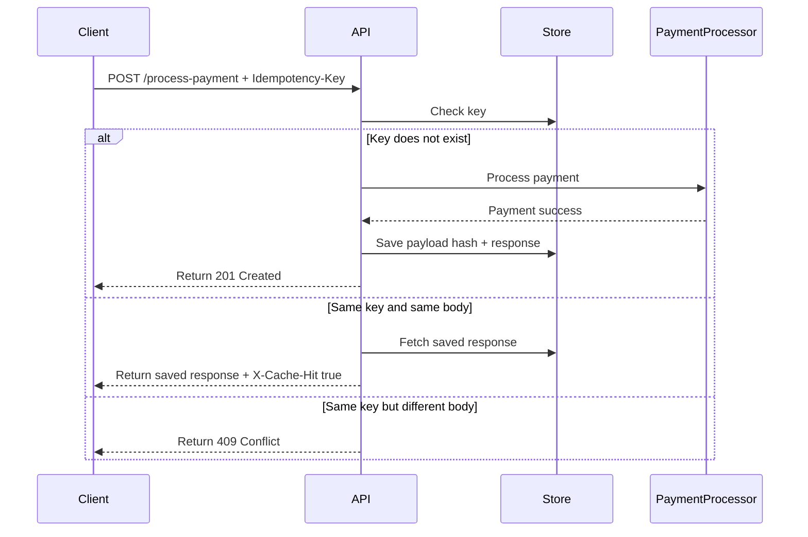

# FinSafe Idempotency Layer API

A RESTful payment-processing simulation that prevents double charging by using an `Idempotency-Key` header.

## Architecture Diagram

This diagram shows how the system ensures idempotency by storing the first response and replaying it for duplicate requests instead of reprocessing payments.