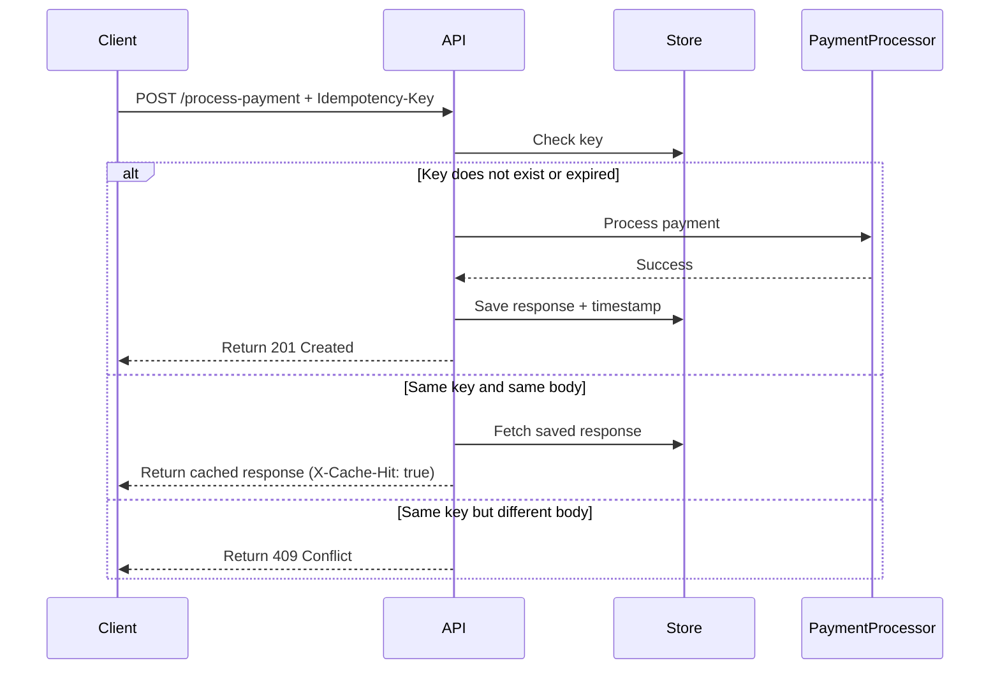

# FinSafe Idempotency Layer API

A RESTful payment processing simulation that ensures **exactly-once execution** using an idempotency mechanism, preventing duplicate charges caused by network retries.

---

## Problem Overview

In real-world e-commerce systems, unstable networks can cause payment requests to be retried automatically.

Without protection:

* A user clicks **“Pay”**
* Network delay occurs
* The client retries the request
* The system processes both requests

 Result: **Customers are charged multiple times**

---

## Solution

This API introduces an **Idempotency Layer** that guarantees:

* A payment request is processed **only once**
* Duplicate requests return the **same saved response**
* Conflicting requests are **rejected**
* Concurrent requests are **safely synchronized**

---

## How It Works

Every request must include:

```http
Idempotency-Key: unique-string
```

### Request Handling Logic

| Scenario                      | Behavior                                      |
| ----------------------------- | --------------------------------------------- |
| First request with new key    | Process payment and store response            |
| Same key + same payload       | Return cached response instantly              |
| Same key + different payload  | Reject request (409 Conflict)                 |
| Concurrent identical requests | Second request waits and receives same result |

---

## Added Feature: Idempotency Key Expiration (TTL)

To make the system more robust and production-ready, a **Time-To-Live (TTL)** mechanism is implemented.

### What It Does

Each idempotency key is stored with a timestamp and automatically expires after **24 hours**.

### Why It Matters

* Prevents **unbounded memory growth**
* Avoids **stale key conflicts**
* Allows safe reuse of keys after expiration
* Mimics real-world payment systems like Stripe

### Behavior with TTL

| Scenario                     | Result                   |
| ---------------------------- | ------------------------ |
| Duplicate request within 24h | Cached response returned |
| Same key after expiration    | Treated as a new payment |
| Expired key                  | Automatically removed    |

---

## Architecture Diagram



---

## API Endpoint

### POST `/process-payment`

#### Headers

```http
Idempotency-Key: unique-string
Content-Type: application/json
```

#### Body

```json
{
  "amount": 100,
  "currency": "GHS"
}
```

---

## Example Scenarios

### First Request (Processed)

```json
{
  "message": "Charged 100 GHS",
  "status": "success"
}
```

---

### Duplicate Request (Cached)

* No delay
* Same response returned
* Header:

```http
X-Cache-Hit: true
```

---

### Same Key, Different Payload

```json
{
  "detail": "Idempotency key already used for a different request body."
}
```

---

## Tech Stack

* FastAPI (Python)
* Async Locks (Concurrency control)
* In-memory store (extendable to Redis)

---

## Future Improvements

* Redis for persistent storage
* Monitoring & logging
* Authentication & rate limiting
* Cloud deployment

---

## Summary

This system ensures:

* **No double charging**
* **Safe retries**
* **Data integrity**
* **Concurrency control**
* **Scalable key management with TTL**

It reflects how modern payment systems handle **reliability and fault tolerance in distributed environments**.

## Author
### Godson Mugisha

Backend Developer | Security Enthusiast
Portfolio: https://mug1sha.github.io/
Passionate about building real-world, production-grade systems