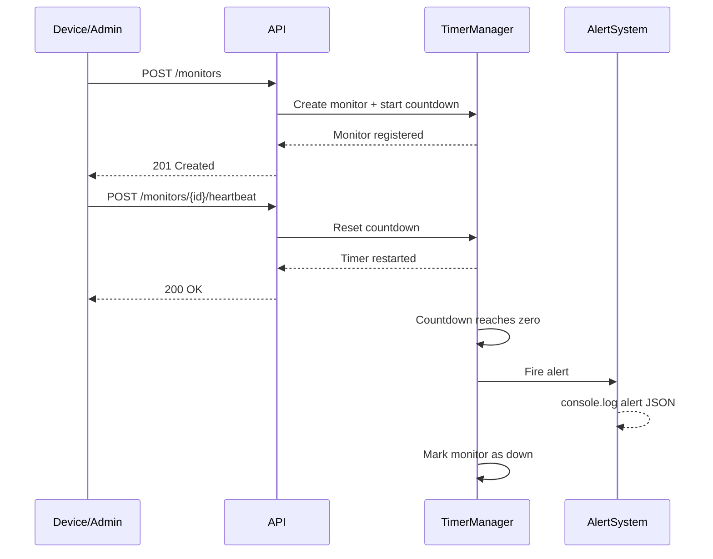

# Pulse-Check-API ("Watchdog" Sentinel)

This challenge is designed to test your ability to bridge Computer Science fundamentals with Modern Backend Engineering.

### Diagram Explanation

This sequence diagram shows how the Pulse-Check API tracks device health in real time. A device or administrator first registers a monitor, which starts a countdown timer managed by the system. Each time the device sends a heartbeat, the timer is reset, ensuring the system knows the device is still active. If no heartbeat is received before the timeout expires, the timer reaches zero and automatically triggers an alert, marking the device as "down". This design guarantees that failures are detected instantly without requiring manual monitoring.

## Extra feature to added

### A monitor status endpoint with remaining time.

This makes the system much more user-friendly because admins can see not only whether a device is active, paused, or down, but also how close it is to triggering an alert.