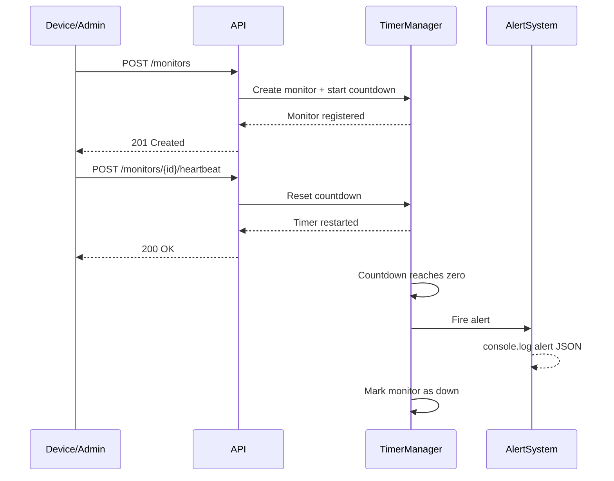

# Pulse-Check-API ("Watchdog" Sentinel)

This challenge is designed to test your ability to bridge Computer Science fundamentals with Modern Backend Engineering.

```mermaid
sequenceDiagram
    participant Device/Admin
    participant API
    participant TimerManager
    participant AlertSystem

    Device/Admin->>API: POST /monitors
    API->>TimerManager: Create monitor + start countdown
    TimerManager-->>API: Monitor registered
    API-->>Device/Admin: 201 Created

    Device/Admin->>API: POST /monitors/{id}/heartbeat
    API->>TimerManager: Reset countdown
    TimerManager-->>API: Timer restarted
    API-->>Device/Admin: 200 OK

    TimerManager->>TimerManager: Countdown reaches zero
    TimerManager->>AlertSystem: Fire alert
    AlertSystem-->>AlertSystem: console.log alert JSON
    TimerManager->>TimerManager: Mark monitor as down
```

