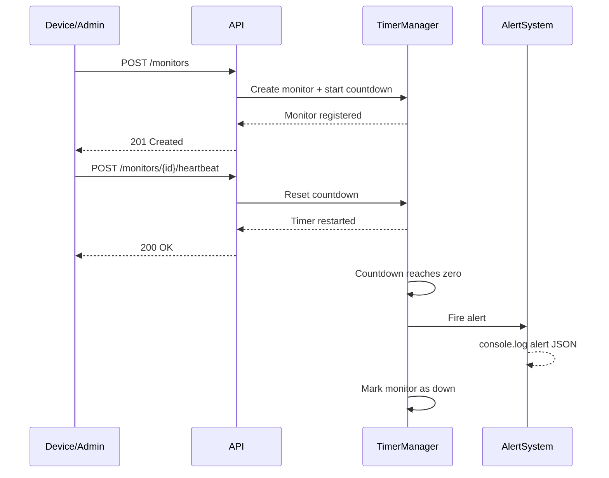

# Pulse-Check API — Dead Man’s Switch Monitoring System

> **A fault-detection backend service that ensures remote devices stay alive — or alerts you instantly when they don’t.**

---

## Overview

Pulse-Check API is a **Dead Man’s Switch system** designed for environments with unreliable connectivity (e.g., solar farms, weather stations, IoT infrastructure).

Devices must periodically send a **heartbeat signal**.
If they fail to do so within a defined timeout, the system automatically marks them as **down** and triggers an alert.

No human monitoring required. No blind spots. Just real-time failure detection.

---

## Core Features

* Register monitors with configurable timeouts
* Heartbeat system to reset countdown timers
* Automatic alert triggering when a device goes silent
* Pause monitoring during maintenance (Snooze feature)
* Real-time status tracking with remaining countdown time
* Clean RESTful API with FastAPI

---

## Architecture



### Diagram Explanation

This diagram illustrates how the system continuously tracks device health.
Each registered device has a countdown timer that resets on every heartbeat.
If the timer expires without receiving a signal, the system automatically triggers an alert and marks the device as **down**, ensuring immediate failure detection.

---

## Getting Started

### 1. Clone Your Fork

```bash
git clone https://github.com/YOUR_USERNAME/pulse-check-api.git
cd pulse-check-api
```

### 2. Set Up Environment

```bash
python -m venv .venv
source .venv/bin/activate
pip install fastapi uvicorn pydantic
```

### 3. Run the Server

```bash
uvicorn main:app --reload
```

Open API docs:

```
http://127.0.0.1:8000/docs
```

---

## API Endpoints

### 🔹 Register Monitor

```http
POST /monitors
```

**Request:**

```json
{
  "id": "device-123",
  "timeout": 60,
  "alert_email": "admin@critmon.com"
}
```

---

### 🔹 Send Heartbeat

```http
POST /monitors/{id}/heartbeat
```

Resets the countdown timer.

---

### 🔹 Pause Monitor (Snooze)

```http
POST /monitors/{id}/pause
```

Stops monitoring temporarily (no alerts will trigger).

---

### 🔹 Get Monitor Status

```http
GET /monitors/{id}/status
```

**Response Example:**

```json
{
  "id": "device-123",
  "status": "active",
  "timeout": 60,
  "remaining_seconds": 42,
  "last_heartbeat": "2026-04-25T10:30:00"
}
```

---

### 🔹 Get All Monitors

```http
GET /monitors
```

---

## Testing the System

### Register a monitor (short timeout for testing):

```bash
curl -X POST http://127.0.0.1:8000/monitors \
-H "Content-Type: application/json" \
-d '{"id":"device-test","timeout":5,"alert_email":"admin@test.com"}'
```

### Wait 5 seconds → Expected output:

```json
{"ALERT": "Device device-test is down!", "time": "..."}
```

### Reset before timeout:

```bash
curl -X POST http://127.0.0.1:8000/monitors/device-test/heartbeat
```

---

## Design Decisions

* **Async Timers (asyncio):** Lightweight and efficient for handling multiple countdowns
* **In-Memory Storage:** Fast for prototyping and demonstration
* **Stateless API Layer:** Business logic separated from HTTP layer
* **Deadline-Based Timing:** Enables accurate remaining time calculation

---

## Limitations (Current Version)

* Data is stored in-memory (lost on restart)
* Not horizontally scalable
* Alerts are simulated via `console.log`

---

## Production Improvements

To make this system enterprise-ready:

* Replace in-memory storage with **PostgreSQL**
* Use **Redis + Celery / BullMQ** for reliable background jobs
* Integrate real alert systems (Email, SMS, Webhooks)
* Add authentication & API keys for device security
* Add monitoring dashboard (Grafana / custom UI)

---

## Future Enhancements

* Retry logic before declaring a device down
* Multi-channel alerting (Slack, SMS, Email)
* Device grouping and tagging
* Historical uptime analytics
* Web dashboard for real-time monitoring

---

## Author

**Godson Mugisha**

* Backend Developer | Security Enthusiast
* Portfolio: https://mug1sha.github.io/
* Passionate about building real-world, production-grade systems

---

## Final Thought

This project demonstrates how a simple concept — *“Are you still alive?”* — can be transformed into a **reliable backend system for critical infrastructure monitoring**.

In real-world systems, failure detection is everything.
And silence… is the most dangerous signal of all.

---
## Live API

## 🌐 Live API

- Base URL: https://amalitech-deg-project-based-challenges-production.up.railway.app/
- API Docs: https://amalitech-deg-project-based-challenges-production.up.railway.app/docs

---
